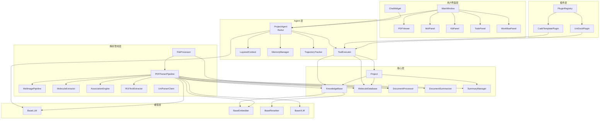

# MBForge 项目全景地图（AI 版）

> 本文档面向 AI 编码助手，提供模块拓扑、数据流、接口契约与实现状态的完整参考。
> 所有状态标记基于源码实际分析，非文档描述。

---

## 一、项目概览

MBForge（Molecular Knowledge Base & AI Workbench）是一款面向药物化学的桌面端知识库应用，采用 PyQt6 构建 GUI，核心定位类似 "Obsidian + Zotero" 的分子科学版本。

**技术栈速查**

| 层 | 核心技术 | 版本约束 |
|--|--|--|
| GUI | PyQt6 + QWebEngineView | ≥6.6 |
| 向量数据库 | ChromaDB (PersistentClient) | ≥0.4 |
| 化学信息学 | RDKit | ≥2024.3 |
| PDF 处理 | PyMuPDF (fitz) | ≥1.25 |
| Embedding | sentence-transformers / API | — |
| LLM 客户端 | openai / anthropic | ≥1.0 / ≥0.103 |
| 深度学习 | PyTorch (CUDA 12.8) | ≥2.6 |
| 包管理 | uv | — |

---

## 二、模块拓扑图



---

## 三、核心数据流

### 流 1：PDF 入库（批量 / CLI）

```
PDF on disk
    ↓
FileProcessor.process_file()
    ├── PDFStrategy.extract()
    │   └── PDFParserPipeline.parse(pdf_path, doc_id)
    │       ├── fitz.open() → text per page → split_text_chunks()
    │       ├── Extract images (max 20, max 2MB) → temp dir
    │       ├── VLM describe images (optional, max 5) → append to text
    │       ├── DocumentSummarizer(llm)
    │       │   ├── L0 prompt (~80 chars) → .mbforge/summaries/{doc_id}.json
    │       │   └── L1 prompt (~1500 chars)
    │       │
    │       ├── Text Molecule Path (always)
    │       │   └── MoleculeExtractor.extract_from_text()
    │       │       ├── Regex SMILES → RDKit validate → mol_db.add_molecule() [LIVE]
    │       │       └── Regex activities → proximity match
    │       │
    │       ├── Image Molecule Path (if use_image_pipeline=True)
    │       │   ├── fitz.render(page) → PIL Image @ 150 DPI
    │       │   ├── MolImagePipeline.extract_page()
    │       │   │   ├── MolDetv2-Doc.detect() → bboxes
    │       │   │   ├── Crop + MolScribe.predict() → SMILES
       │   │   │   └── image_to_pdf_bbox() → PDF coords
    │       │   ├── ROITextExtractor.extract_context() → caption text
    │       │   ├── AssociationEngine.associate_all()
    │       │   └── _save_pending_extractions()
    │       │       └── .mbforge/extractions/{doc_id}/pending.json [PENDING]
    │       │
    │       └── KnowledgeBase.index_document()
    │           ├── Embedder.embed(chunks) [batch_size=64]
    │           └── ChromaDB collection.add()
    │
    ├── PDFStrategy.index() → KB + mol_db
    └── PDFStrategy.store() → output/<doc_id>/
        ├── content.json
        ├── chunks.json
        ├── summary.json
        └── molecules.json
```

**数据消费方**：KnowledgeBase (ChromaDB), MoleculeDatabase (SQLite), SummaryManager (JSON)

### 流 2：交互式 PDF 阅读 + 分子检测

```
User opens PDF → PDFViewer.load_pdf(path, project_root)
    ├── PDFSliceManager.ensure_sliced() [if >100p]
    ├── Precompute sizes → virtual container QWidget
    ├── _render_visible_range()
    │   ├── Sync render visible pages → QPixmap → QLabel
    │   └── Async render off-screen → ThreadPool → _on_pages_ready()
    └── Load annotations from .mbforge/pdf_annotations/{hash}.json

User clicks "检测分子"
    ├── _detect_molecules_current_page()
    │   ├── Render page at view DPI
    │   ├── mol_image_pipeline.extract_page()
    │   └── ExtractionResult[] → DetectionBox[] → AnnotationStore
    ├── _save_annotations()
    └── _refresh_page() [re-render with overlay]

User clicks detection box
    ├── _on_detection_clicked() → DetectionPopup
    │   ├── Confirm → status="confirmed"
    │   ├── Reject → status="rejected"
    │   ├── Edit → MoleculeEditorDialog
    │   └── Save E-SMILES → status="corrected"
    ├── _save_annotations()
    └── _refresh_page()

User drag-selects text
    └── _on_highlight() → TextHighlight → AnnotationStore → save → refresh
```

**数据持久化**：`.mbforge/pdf_annotations/{md5}.json`

### 流 3：Agent 对话（ReAct 循环）

```
User input → ProjectAgent.chat_stream()
    ├── LayeredContext.compose()
    │   ├── L0 system prompt
    │   ├── L1 project context + MemoryManager injection
    │   ├── L2 tool results (ephemeral)
    │   └── L3 conversation history
    ├── LLM.chat() / .chat_stream()
    │   └── Tool call or Direct answer
    ├── If tool call:
    │   ├── ToolExecutor.execute()
    │   │   ├── search_knowledge_base → KB.search() / hybrid_search()
    │   │   ├── find_documents → Project.list_documents()
    │   │   ├── read_document_abstract → SummaryManager.load()
    │   │   ├── list_molecules → MoleculeDatabase.list_all()
    │   │   └── ... (10 tools total)
    │   └── Result → L2 context → next LLM call
    └── TrajectoryTracker.record_step()
        └── .mbforge/trajectory/trajectory.json
```

**记忆更新**：对话结束后，MemoryManager.extract_from_conversation() 自动提取 profile/preferences/entities/events/cases/patterns 到 `.mbforge/memory/`

### 流 4：Zotero 桥接（新增）

```
Zotero 右键菜单「推送到 MBForge」
    ├── 收集条目 metadata + attachments path + annotations
    ├── fetch POST http://localhost:8233/api/v1/zotero/import
    └── MBForge Bridge (aiohttp)
        ├── 复制 PDF → {project}/zotero_imports/{key}_{filename}.pdf
        ├── 保存 annotations → .mbforge/zotero_annotations/{key}.json
        ├── Project.add_file() → 加入索引
        └── (可选 auto_index) PDFParserPipeline.parse()
```

---

## 四、模块清单

### 4.1 核心层（Core）

| 模块 | 文件 | 职责 | 状态 | 输入 | 输出 | 依赖 | 待办 |
|------|------|------|------|------|------|------|------|
| Project | `core/project.py` | Vault 项目管理、文档索引 | ✅ 完整 | Path | DocumentEntry[], index.json | settings, helpers | — |
| KnowledgeBase | `core/knowledge_base.py` | ChromaDB 语义检索 | ✅ 完整 | text chunks, metadata | search results | chromadb, embedder | — |
| MoleculeDatabase | `core/mol_database.py` | SQLite+RDKit 分子库 | ✅ 完整 | MoleculeRecord | molecules, properties | rdkit (optional) | — |
| DocumentProcessor | `core/document.py` | 文件读取与基础提取 | ⚠️ 部分 | Path | ExtractedContent | fitz (optional) | 表格提取未实现 |
| DocumentSummarizer | `core/summarizer.py` | LLM 三层摘要 L0/L1/L2 | ⚠️ 部分 | ExtractedContent | DocumentSummary | llm | L2 按需加载未实现；keywords 粗糙 |
| SummaryManager | `core/summarizer.py` | 摘要持久化 | ✅ 完整 | doc_id, DocumentSummary | JSON | — | — |
| ProjectSettings | `core/settings.py` | 项目级配置 | ✅ 完整 | JSON | ProjectSettings | — | — |
| TodoManager | `core/todo_manager.py` | TODO 队列持久化 | ✅ 完整 | file entries | todo list JSON | — | — |
| Memory | `core/memory.py` | Agent 记忆模板 | ✅ 完整 | conversation | memory JSON | — | — |

### 4.2 模型层（Models）

| 模块 | 文件 | 职责 | 状态 | 输入 | 输出 | 依赖 | 待办 |
|------|------|------|------|------|------|------|------|
| BaseLLM | `models/base.py` | LLM 抽象接口 | ✅ 完整 | messages | text / stream | — | — |
| OpenAILLM | `models/llm.py` | OpenAI 兼容 LLM | ✅ 完整 | messages | text / stream / tool_calls | openai | — |
| AnthropicLLM | `models/anthropic_llm.py` | Anthropic SDK 兼容 | ✅ 完整 | messages | text / stream / tool_calls | anthropic | — |
| NemotronDiffusionLLM | `models/nemotron_diffusion.py` | 本地 Nemotron 扩散 | ⚠️ 部分 | messages | text | transformers | chat_stream 为伪流式 |
| SentenceTransformerEmbedder | `models/embedding.py` | 本地 Embedding | ✅ 完整 | texts | embeddings | sentence-transformers | — |
| Qwen3Embedder | `models/embedding.py` | Qwen3 Embedding | ✅ 完整 | texts | embeddings | transformers | — |
| APIEmbedder | `models/embedding.py` | API Embedding | ✅ 完整 | texts | embeddings | openai | — |
| SentenceTransformerReranker | `models/rerank.py` | CrossEncoder 重排 | ✅ 完整 | query, passages | ranked list | sentence-transformers | — |
| Qwen3Reranker | `models/rerank_qwen3.py` | CausalLM 重排 | ✅ 完整 | query, passages | ranked list | transformers | — |
| APIVLM | `models/vlm.py` | API 视觉语言模型 | ⚠️ 部分 | image path | description | openai | 无本地 VLM |

### 4.3 Agent 层

| 模块 | 文件 | 职责 | 状态 | 输入 | 输出 | 依赖 | 待办 |
|------|------|------|------|------|------|------|------|
| ProjectAgent | `agent/agent.py` | ReAct 协调器 | ✅ 完整 | user query | answer / stream | llm, executor, context | max_iterations=5 硬编码 |
| ToolExecutor | `agent/executor.py` | 工具执行器 | ✅ 完整 | tool name, args | tool result | registry, kb, mol_db | — |
| ToolRegistry | `agent/tools.py` | 工具注册表 | ✅ 完整 | tool definitions | schemas, dispatch | — | — |
| LayeredContext | `agent/context.py` | 四层上下文 | ✅ 完整 | messages, tool results | composed prompt | — | — |
| MemoryManager | `agent/memory_manager.py` | 6 类记忆管理 | ✅ 完整 | conversation | memory JSON | llm | 无 schema 约束 LLM JSON |
| TrajectoryTracker | `agent/trajectory.py` | 检索轨迹 | ✅ 完整 | step info | trajectory JSON | — | — |
| ArchiveAgent | `agent/archive_agent.py` | 后台归档 Agent | ✅ 完整 | completed todos | indexed docs | thread | — |

### 4.4 解析管线层（Parsers）

| 模块 | 文件 | 职责 | 状态 | 输入 | 输出 | 依赖 | 待办 |
|------|------|------|------|------|------|------|------|
| PDFParserPipeline | `parsers/pdf_parser.py` | PDF 解析主流程 | ✅ 完整 | pdf_path | ExtractedContent | fitz, llm, embedder, vlm, mol_pipeline | — |
| MolImagePipeline | `parsers/molecule/mol_image_pipeline.py` | MolDetv2 图像检测 | ✅ 完整 | PIL Image | ExtractionResult[] | ultralytics, transformers | 需模型文件 |
| MoleculeExtractor | `parsers/molecule/molecule_extractor.py` | 文本正则提取 SMILES | ✅ 完整 | text | MoleculeRecord[] | rdkit (optional) | — |
| ROITextExtractor | `parsers/molecule/roi_text_extractor.py` | ROI 上下文文本提取 | ✅ 完整 | pdf_path, bbox | context text | pdfplumber | — |
| AssociationEngine | `parsers/molecule/association_engine.py` | 分子-活性关联 | ✅ 完整 | ExtractionResult[] | enriched results | — | — |
| ExtractionResult | `parsers/molecule/extraction_result.py` | 提取结果数据契约 | ✅ 完整 | — | dataclass | — | — |
| ParserClient | `parsers/uniparser/uniparser_client.py` | UniParser API 客户端 | ✅ 完整 | pdf_path | ParseResult | uniparser_tools | — |
| GlmOcrClient | `parsers/uniparser/glm_ocr_parser.py` | GLM OCR 解析器 | ✅ 完整 | pdf_path | ParseOutput | requests | — |
| FileProcessor | `parsers/file_processor.py` | 文件类型策略分发 | ✅ 完整 | Path | result dict | strategies | — |
| PDFStrategy | `parsers/file_processor.py` | PDF 处理策略 | ✅ 完整 | TodoEntry | ExtractedContent | PDFParserPipeline | — |
| MarkdownStrategy | `parsers/file_processor.py` | Markdown 策略 | ✅ 完整 | Path | ExtractedContent | — | — |
| TextStrategy | `parsers/file_processor.py` | 纯文本策略 | ✅ 完整 | Path | ExtractedContent | — | — |
| MoleculeStrategy | `parsers/file_processor.py` | 分子文件策略 | ✅ 完整 | Path | ExtractedContent | rdkit | — |
| DataTableStrategy | `parsers/file_processor.py` | 数据表策略 | ✅ 完整 | Path | ExtractedContent | pandas | — |
| JsonStrategy | `parsers/file_processor.py` | JSON 策略 | ✅ 完整 | Path | ExtractedContent | — | — |

### 4.5 UI 层

| 模块 | 文件 | 职责 | 状态 | 输入 | 输出 | 依赖 | 待办 |
|------|------|------|------|------|------|------|------|
| MainWindow | `ui/main_window.py` | 主窗口协调器 | ✅ 完整 | Project, models | UI events | 所有面板 | — |
| ThemeManager | `ui/theme.py` | 主题管理器 | ✅ 完整 | — | palette, stylesheets | PyQt6 | — |
| ChatWidget | `ui/chat_widget.py` | AI 对话面板 | ✅ 完整 | ProjectAgent | stream text | PyQt6, WebEngine | — |
| FileTree | `ui/file_tree.py` | 增量文件树 | ✅ 完整 | Project | file_opened signal | PyQt6 | — |
| PDFViewer | `ui/pdf_viewer/viewer.py` | PDF 查看器 | ✅ 完整 | Path | rendered pages | fitz, PyQt6 | 确认按钮未接 mol_db |
| PDFRenderer | `ui/pdf_viewer/renderer.py` | 线程池渲染 | ✅ 完整 | fitz.Page | QImage | fitz, PyQt6 | — |
| PDFSliceManager | `ui/pdf_viewer/slice_manager.py` | 大 PDF 分片 | ✅ 完整 | Path | slice paths | fitz | — |
| AnnotationStore | `ui/pdf_viewer/annotations.py` | 注释持久化 | ✅ 完整 | annotations | JSON | — | — |
| DetectionPopup | `ui/pdf_viewer/detection_popup.py` | 检测框弹窗 | ✅ 完整 | DetectionBox | signals | PyQt6, rdkit | — |
| MolPanel | `ui/panels/mol.py` | 分子数据库面板 | ✅ 完整 | MoleculeDatabase | filter, select | PyQt6, rdkit | — |
| KbPanel | `ui/panels/kb.py` | 知识库面板 | ✅ 完整 | KnowledgeBase | search, delete | PyQt6 | — |
| TodoPanel | `ui/panels/todo.py` | TODO 队列面板 | ✅ 完整 | TodoManager | progress | PyQt6 | — |
| WorkflowPanel | `ui/panels/workflow.py` | 工作流中心 | ⚠️ 占位 | — | static cards | PyQt6 | 无实际后端连接 |
| WelcomeWidget | `ui/panels/welcome.py` | 欢迎首页 | ✅ 完整 | config | open project | PyQt6 | — |
| PDFLibrary | `ui/panels/pdf_library.py` | 文献库面板 | ✅ 完整 | Project | pdf_opened | PyQt6 | — |
| MolEditor | `ui/mol_editor/` | 分子结构编辑器 | ✅ 完整 | E-SMILES | edited structure | PyQt6, rdkit | — |
| SettingsDialog | `ui/dialogs.py` | 设置对话框 | ✅ 完整 | config | saved config | PyQt6 | — |

### 4.6 插件层

| 模块 | 文件 | 职责 | 状态 | 输入 | 输出 | 依赖 | 待办 |
|------|------|------|------|------|------|------|------|
| PluginRegistry | `plugins/registry.py` | 插件自动发现 | ✅ 完整 | — | plugin instances | pkgutil | — |
| BasePlugin | `plugins/base.py` | 插件基类 | ✅ 完整 | — | metadata, tools, panels | — | — |
| UniDockPlugin | `plugins/unidock/` | GPU 加速对接 | ✅ 完整 | receptor, ligands | docking results | unidock binary | — |
| CaddTemplatePlugin | `plugins/cadd_template/` | CADD 模板 | ⚠️ 部分 | inputs | results | vina/gnina | MD/FEP 为 NotImplementedError |

### 4.7 工作流（Workflow）

> **注意**：`src/mbforge/workflow/` 目录已不存在，原 generation/docking/qsar/md 模块已移除。
> 工作流功能已迁移至插件系统。

| 工作流 | 承载位置 | 状态 | 说明 |
|--------|----------|------|------|
| 分子生成 | 无 | ❌ 未实现 | 原 workflow/generation.py 已移除 |
| 分子对接 | unidock 插件 + cadd_template 插件 | ✅ 实现 | UniDock / Vina / GNINA |
| QSAR/ADMET | cadd_template 插件 | ⚠️ 部分 | RDKit descriptors + Lipinski ✅；复杂模型 ❌ |
| 分子动力学 | cadd_template 插件 | ❌ 未实现 | GROMACS 部分代码；AMBER/SOMD 抛异常 |
| FEP | cadd_template 插件 | ❌ 未实现 | NotImplementedError |

---

## 五、数据流矩阵

| 数据实体 | 生产者 | 消费者 | 格式 | 存储位置 |
|----------|--------|--------|------|----------|
| `ExtractedContent` | PDFParserPipeline, FileProcessor strategies | KnowledgeBase.index_document, SummaryManager | dataclass | 内存 → output/<doc_id>/content.json |
| text chunks | `split_text_chunks()` | KnowledgeBase.index_document | list[str] | output/<doc_id>/chunks.json |
| L0/L1/L2 摘要 | DocumentSummarizer | SummaryManager, KnowledgeBase._get_summary | DocumentSummary | .mbforge/summaries/{doc_id}.json |
| MoleculeRecord | MoleculeExtractor, MolImagePipeline | MoleculeDatabase.add_molecule | dataclass | SQLite + .mbforge/extractions/ |
| pending extractions | MolImagePipeline | 人工确认 UI | ExtractionResult[] | .mbforge/extractions/{doc_id}/pending.json |
| 向量嵌入 | Embedder.embed | ChromaDB collection.add | list[float] | ChromaDB persistent storage |
| 搜索/对话轨迹 | TrajectoryTracker | 日志/复盘 | TrajectoryStep[] | .mbforge/trajectory/trajectory.json |
| Agent 记忆 | MemoryManager | LayeredContext (L1 injection) | category JSON | .mbforge/memory/{category}.json |
| 阅读批注 | PDFViewer | AnnotationStore | DetectionBox / TextHighlight | .mbforge/pdf_annotations/{hash}.json |
| 项目索引 | Project.scan_files, Project.add_file | 所有需要文档列表的模块 | DocumentEntry[] | .mbforge/index.json |
| TODO 队列 | TodoManager.add_file | TodoPanel, ArchiveAgent | TodoEntry[] | .mbforge/todo.json |
| Zotero 同步数据 | Zotero Bridge (aiohttp) | Project.add_file, AnnotationStore | ZoteroItem + annotations | .mbforge/zotero_annotations/{key}.json |

---

## 六、接口清单（关键公共 API）

### 6.1 Project

```python
class Project:
    @classmethod
    def create(cls, root: Path, name: str = "") -> Project  # ✅
    @classmethod
    def open(cls, root: Path) -> Project | None  # ✅
    @classmethod
    def is_valid_project(cls, root: Path) -> bool  # ✅
    def scan_files(self) -> list[DocumentEntry]  # ✅
    def add_file(self, path: Path) -> DocumentEntry  # ✅
    def remove_document(self, doc_id: str) -> None  # ✅
    def list_documents(self, doc_type: str | None = None) -> list[DocumentEntry]  # ✅
    def get_document(self, doc_id: str) -> DocumentEntry | None  # ✅
```

### 6.2 KnowledgeBase

```python
class KnowledgeBase:
    def index_document(self, doc_id: str, content: ExtractedContent, metadata: dict | None = None) -> None  # ✅
    def search(self, query: str, top_k: int = 5, filter_dict: dict | None = None) -> list[dict]  # ✅
    def hybrid_search(self, query: str, top_k: int = 5, filter_dict: dict | None = None) -> list[dict]  # ✅
    def search_by_directory(self, query: str, directory: str, top_k: int = 5) -> list[dict]  # ✅
```

### 6.3 MoleculeDatabase

```python
class MoleculeDatabase:
    def add_molecule(self, record: MoleculeRecord) -> str  # ✅
    def get_molecule(self, mol_id: str) -> MoleculeRecord | None  # ✅
    def search_by_smiles(self, smiles: str) -> list[MoleculeRecord]  # ✅
    def search_by_activity_range(self, min_val: float, max_val: float, field: str = "activity") -> list[MoleculeRecord]  # ✅
    def list_all(self, source_type: str | None = None, status: str | None = None) -> list[MoleculeRecord]  # ✅
```

### 6.4 PDFParserPipeline

```python
class PDFParserPipeline:
    def __init__(self, llm=None, embedder=None, vlm=None, knowledge_base=None, mol_db=None, mol_image_pipeline=None)  # ✅
    def parse(self, pdf_path: Path, doc_id: str = "", extract_molecules: bool = True, summarize: bool = True, index_kb: bool = True, use_image_pipeline: bool = False, image_pipeline_dpi: float = 150.0) -> ExtractedContent  # ✅
    @classmethod
    def load_pending_extractions(cls, path: Path) -> list[ExtractionResult]  # ✅
```

### 6.5 ProjectAgent

```python
class ProjectAgent:
    def __init__(self, llm: BaseLLM, project: Project, knowledge_base: KnowledgeBase, mol_db: MoleculeDatabase, embedder: BaseEmbedder | None = None, reranker: BaseReranker | None = None)  # ✅
    def chat(self, user_input: str, system_prompt: str | None = None) -> str  # ✅
    def chat_stream(self, user_input: str, system_prompt: str | None = None) -> Iterator[str]  # ✅
```

### 6.6 PluginRegistry

```python
class PluginRegistry:
    @classmethod
    def instance(cls) -> PluginRegistry  # ✅ singleton
    def discover(self) -> None  # ✅ auto-scan
    def get_plugins(self) -> list[BasePlugin]  # ✅
    def get_tools(self) -> list[ToolInfo]  # ✅
    def get_ui_panels(self) -> list[tuple[str, QWidget]]  # ✅
    def get_cli_commands(self) -> list[tuple[str, callable]]  # ✅
```

---

## 七、待办清单（源码级 TODO）

### 7.1 高优先级（功能缺失）

| 待办 | 位置 | 影响 | 建议方案 |
|------|------|------|----------|
| 表格提取 | `core/document.py:extract_pdf_tables()` | PDF 中的表格无法结构化 | 接入 camelot / tabula / UniParser |
| PDF 查看器确认按钮接 mol_db | `ui/pdf_viewer/viewer.py:_on_molecule_confirmed()` | 用户确认的分子未自动入库 | 注入 mol_db 并调用 add_molecule |
| WorkflowPanel 后端连接 | `ui/panels/workflow.py` | 工作流中心纯占位 | 接入插件系统的 workflow steps |
| 本地 VLM | `models/vlm.py` | 必须联网才能分析图片 | 接入 Qwen2-VL / LLaVA 本地模型 |

### 7.2 中优先级（体验优化）

| 待办 | 位置 | 影响 | 建议方案 |
|------|------|------|----------|
| L2 摘要按需加载 | `core/summarizer.py` | L2 未实现分页详细摘要 | 按章节/页生成 L2 |
| keywords 用 LLM 提取 | `core/summarizer.py:_extract_keywords()` | 当前为简单词频统计 | 改为 LLM NER |
| Zotero 双向同步 | `zotero_bridge/` | 仅支持 Zotero→MBForge | 增加 MBForge→Zotero 批注回写 |
| 分子生成模块 | 无 | 原 workflow 已移除 | 在插件系统中新增生成插件 |

### 7.3 低优先级（代码整洁）

| 待办 | 位置 | 说明 |
|------|------|------|
| `refresh()` 方法不存在 | `ui/pdf_viewer/viewer.py:_on_theme_changed()` | 应调用 `_invalidate_and_reload()` |
| `_summarize()` 遗留方法 | `parsers/pdf_parser.py` | 已被 DocumentSummarizer 取代，可移除 |
| NemotronDiffusionLLM 伪流式 | `models/nemotron_diffusion.py` | chat_stream 直接 yield 完整结果 |
| UniParser-Tools workspace | `pyproject.toml` | 目录结构异常，需确认是否移动 |

---

## 八、模块兼容性矩阵

| 消费者 →<br>生产者 ↓ | Project | KB | MolDB | LLM | Embedder | Reranker | VLM | Agent | Plugin |
|--|:--:|:--:|:--:|:--:|:--:|:--:|:--:|:--:|:--:|
| **Project** | — | 创建时注入 | 创建时注入 | ❌ | ❌ | ❌ | ❌ | 注入 | ❌ |
| **KB** | 读取 root | — | ❌ | ❌ | ✅ 必需 | ✅ 可选 | ❌ | 被调用 | ❌ |
| **MolDB** | 读取 root | ❌ | — | ❌ | ❌ | ❌ | ❌ | 被调用 | ❌ |
| **LLM** | ❌ | ❌ | ❌ | — | ❌ | ❌ | ❌ | ✅ 必需 | 被调用 |
| **Embedder** | ❌ | 被调用 | ❌ | ❌ | — | ❌ | ❌ | 可选 | ❌ |
| **Reranker** | ❌ | 被调用 | ❌ | ❌ | ❌ | — | ❌ | 可选 | ❌ |
| **VLM** | ❌ | ❌ | ❌ | ❌ | ❌ | ❌ | — | ❌ | ❌ |
| **Agent** | ✅ 必需 | ✅ 必需 | ✅ 必需 | ✅ 必需 | ✅ 可选 | ✅ 可选 | ❌ | — | ✅ 调用 |
| **Plugin** | 可选 | 可选 | 可选 | 可选 | ❌ | ❌ | ❌ | 注册工具 | — |
| **PDFPipeline** | ❌ | ✅ 索引 | ✅ 入库 | ✅ 摘要 | ✅ 索引 | ❌ | ✅ 图片描述 | ❌ | ❌ |

**图例**：✅ 存在依赖关系 | ❌ 无直接依赖

---

*文档结束。如需更新，请同步修改源码后重新运行分析。*
