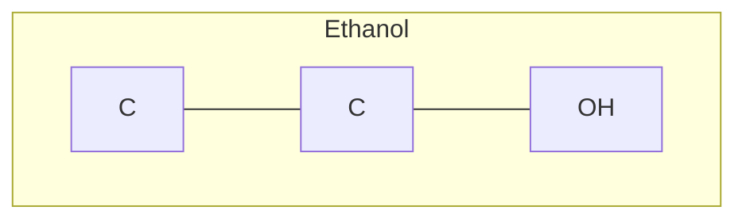
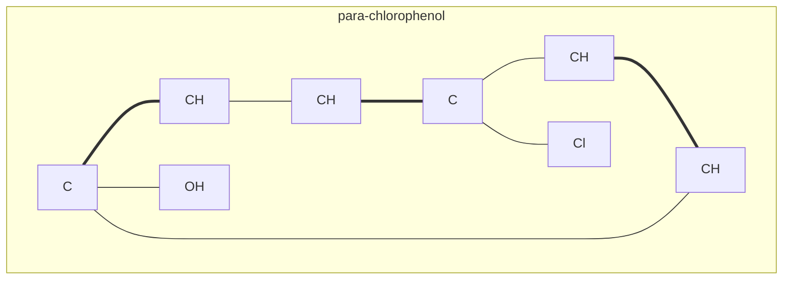
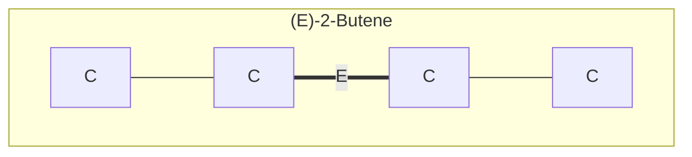
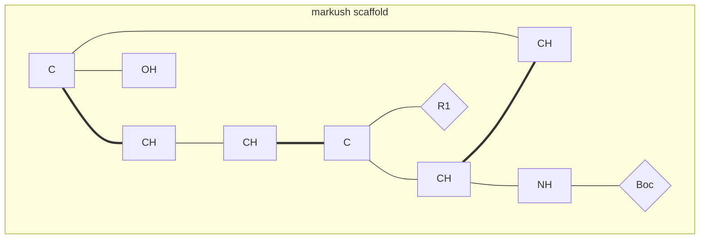
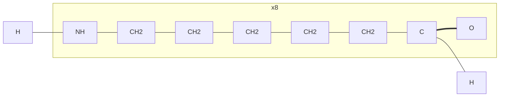

# MoleCode 规范

> 版本: 1.0 · 日期: 2026-06-04

---

## 1. 概述

MoleCode 是一种基于 Mermaid 图语法的显式拓扑分子表示格式。每个原子是一个命名节点，每个键是一条显式边，分子结构直接可读、可渲染、可比较。

**设计目标**：
- LLM 友好：纯文本，无需特殊解析器
- 显式拓扑：无隐式连接，无位置编码
- 可逆转换：与 SMILES 无损互转
- 可渲染：标准 Mermaid 渲染器即可显示

---

## 2. 文档结构

```text
graph TB          (或 graph LR 用于聚合物)
    subgraph ID["display name"]
        ...       原子/缩写节点声明
        ...       键边声明
    end
```

- `graph TB`：自上而下布局（小分子默认）
- `graph LR`：从左到右布局（聚合物）
- `%%`：注释行
- 键可以跨越 subgraph 边界

---

## 3. 节点声明

### 3.1 原子节点

**格式**：`prefix_Element_Number[DisplayLabel]`

```text
Ethanol_C_1[C]       Ethanol_C_2[CH2]      Ethanol_O_1[OH]
Aspirin_C_3_R[CH]    Nitro_N_1[N(+)]       Nitro_O_2[O(-)]
```

**DisplayLabel 格式**：
```bnf
<display-label> ::= <element> [<h-count>] [<charge>]
<h-count>       ::= "H" [<digit>]
<charge>        ::= "(" [<digit>] ("+" | "-") ")"
```

**解析正则**：`^([A-Z][a-z]?)(?:H(\d*))?(?:\((\d*[+-])\))?$`

| 标签 | 元素 | H | 电荷 |
|------|------|---|------|
| `[C]` | C | 0 | 0 |
| `[CH3]` | C | 3 | 0 |
| `[CH]` | C | 1 | 0 |
| `[OH]` | O | 1 | 0 |
| `[NH2]` | N | 2 | 0 |
| `[N(+)]` | N | 0 | +1 |
| `[O(-)]` | O | 0 | -1 |
| `[NH3(+)]` | N | 3 | +1 |
| `[Cl]` | Cl | 0 | 0 |

**规则**：
- 氢原子数是**显式**的 — 添加键时必须更新 H 数（`[CH3]` 加一个键变为 `[CH2]`）
- 带取代基的芳香碳用 `[C]`（0 H），仅有环键的芳香碳用 `[CH]`（1 H）
- 电荷格式：数字在前，符号在后 `(+)`、`(-)`、`(2+)`

**手性**：`_R` 或 `_S` 后缀（CIP 绝对构型）
```text
R2butanol_C_2_R[CH]       S2butanol_C_2_S[CH]
```

### 3.2 缩写节点（Markush）

**格式**：`prefix_X_Number{Label}` — 花括号

```text
Mol_X_1{Boc}       Mol_X_2{R1}       Mol_X_3{Ph}
```

- 一等公民图节点，用于 R-group 和命名取代基
- 每个 `{...}` 包含一个化学意义的缩写
- 复合标签如 `NHBoc` 必须分解为 `[NH] --- {Boc}`

---

## 4. 边声明

**格式**：`node1_id <operator> node2_id`

| 操作符 | 键类型 | RDKit 常量 |
|--------|--------|-----------|
| `---` | 单键 | `BondType.SINGLE` |
| `===` | 双键 | `BondType.DOUBLE` |
| `-.-` | 三键 | `BondType.TRIPLE` |
| `-->` | 配位键 | `BondType.DATIVE` |
| `<-->` | 芳香键 | `BondType.AROMATIC` |

**双键立体化学**：
```text
node1 ===|E| node2       (E / trans)
node1 ===|Z| node2       (Z / cis)
```

**芳香环**必须用 Kekule 形式（显式单/双键交替）：
```text
benzene_C_1 === benzene_C_2
benzene_C_2 --- benzene_C_3
benzene_C_3 === benzene_C_4
...
```

---

## 5. 示例

### 乙醇（SMILES: `CCO`）



### 对氯苯酚（SMILES: `Oc1ccc(Cl)cc1`）



### (E)-2-丁烯（立体双键）



### Markush 骨架（苯酚 + R1 + Boc）



### 硝基甲烷（带电荷）

```mermaid
graph TB
    subgraph nitromethane["nitromethane"]
        nitromethane_C_1[CH3]
        nitromethane_N_1[N(+)]
        nitromethane_O_1[O]
        nitromethane_O_2[O(-)]
        nitromethane_C_1 --- nitromethane_N_1
        nitromethane_N_1 === nitromethane_O_1
        nitromethane_N_1 --- nitromethane_O_2
    end
```

---

## 6. 聚合物表示

聚合物用 `graph LR`，添加重复单元 subgraph + `xN` 计数标签 + `TL`/`TR` 终止标记。

**Nylon-6**（`*NCCCCCC(=O)*`，重复 x8）：


---

## 7. 缩写展开规则

缩写节点 `{Label}` 在比较时可展开为完整子图：

| 类别 | 示例 | 展开方式 |
|------|------|----------|
| 单原子等价 | `{Me}` → `[CH3]` | 标签替换 |
| 多原子子图 | `{Boc}` → 7 原子子图 | 替换为完整图 |
| 不可展开 | `{R1}`、`{X}` | 按名称匹配 |

详见 `abbreviation_map.rs`。

---

## 8. 与 SMILES/E-SMILES 的关系

```text
SMILES ──smiles_to_esmiles()──→ E-SMILES
  │                                │
  │  parse_esmiles_tags()          │  parse_esmiles_tags()
  ↓                                ↓
SMILES ──esmiles_to_molecode()──→ MoleCode
```

- SMILES → E-SMILES：添加 `<sep>` + 标签（信息增加）
- E-SMILES → SMILES：取 `<sep>` 前的内容（信息减少）
- E-SMILES → MoleCode：图转换（信息等价，格式不同）
- MoleCode → SMILES：需要 Mermaid 解析器（参考 `ref/MoleCode/`）

---

## 9. 实现位置

| 文件 | 功能 |
|------|------|
| `src-tauri/src/core/molecode.rs` | E-SMILES → MoleCode 转换器 |
| `src-tauri/src/core/abbreviation_map.rs` | 缩写展开映射表 |
| `src-tauri/src/commands/molecode.rs` | Tauri 命令 `esmiles_to_molecode_cmd` |
| `frontend/src/components/ui/MermaidCode.tsx` | Mermaid 渲染组件 |
| `ref/MoleCode/` | 参考实现（Python） |
