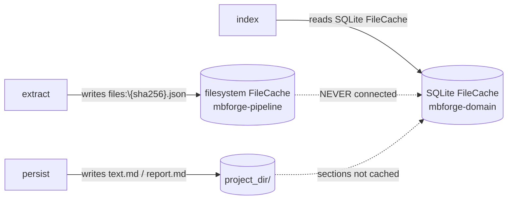

# MBForge Pipeline Review — 2026-06-25

> **ARCHIVED / HISTORICAL** — point-in-time snapshot. Numbers, paths, and stage/router counts may be **wrong today**. Do not treat as current API. Canonical: [../README.md](../README.md) · pipeline: [../architecture/pipeline-stages.md](../architecture/pipeline-stages.md).

**Scope**: `src-tauri/crates/mbforge-pipeline/` 全量 (~7145 LOC) — pipeline runner / 5 stages / services / models / writers / chem / pdf / ocr / structure + `ingest_worker/`。

**Method**: 4 parallel `cavecrew-reviewer` agents (core / ingest_worker / leaf / services) + my own reads of services + writers + 入口。Reviewer #4 (services) ran out of budget mid-way; its findings are supplemented by my own reads of services/{ocr,cache,images,quick_moldet,merge,molecules}. Total raw findings: ~150; consolidated below to 60+ actionable items.

**Test baseline** (before any changes):

| Crate | Passed | Failed | Notes |
|---|---|---|---|
| `mbforge-pipeline` (lib) | 189 | 1 | `structure::post_process::tests::test_post_process_sections_parallel_all_fail_fast` — environment-sensitive (requires no LLM key in env) |
| `mbforge-domain` (lib) | 0 | 0 | no tests in this crate |
| `mbforge-app` (lib) | 19 | 0 | one doctest failure in `commands::mol_engine::with_engine` (unrelated) |
| `tests/pipeline_v2.rs` | dead | — | workspace root has no `Cargo.toml` package, file is never compiled |

---

## TL;DR — The One Critical Bug

**`IndexStage` reads `kb.file_cache()` (SQLite in `mbforge-domain`), but no v2 stage ever writes to it.** Persist writes to `text.md` and the filesystem `FileCache` (JSON files at `{root}/index/file-cache/{sha256}.json`); index reads from a completely separate SQLite table. Result: `indexed_sections == 0` on every successful v2 run. The integration test `src-tauri/tests/pipeline_v2.rs:51` `assert_eq!(indexed.indexed_sections, 0)` is a self-fulfilling assertion that passes **because** the bug exists.

**The "Stage 1A-1E" plan below is structured to fix this first, then iteratively migrate `ingest_worker` to a single `run_pipeline` stage.**

---

## Severity Counts (after dedup)

| Severity | Count | Examples |
|---|---|---|
| BLOCKER | 1 | Cache dead-link in v2 → `indexed_sections == 0` |
| HIGH (correctness) | 12 | `emit_log` spawn storm, hot-loop regex, `chem::chem_validate` `Regex::new` in hot path, `chem::claim_policy` unbounded matches, `pdf::mineru` zip OOM, `pdf::llama_parse` API key in form field, `pdf::sidecar_render` client re-creation, `ocr::paddle` blocking client per call, `ocr::uniparser` full-read upload, `structure::post_process` merge-path double-unwrap, `ingest_worker` non-atomic stage transitions, `ingest_worker` unknown-stage retry loop |
| MEDIUM | 30+ | path safety, error mapping, regex precompilation, allocation patterns, test gaps |
| LOW / nit | 20+ | dead fields, `#[allow(dead_code)]` files, `PipelineRunner` ZST, missing docs |

---

## 1. Architecture (v2 runner / context / error)

| Sev | Location | Problem | Fix |
|---|---|---|---|
| HIGH | `pipeline/runner.rs:80-114` | `StageStart` fires before `?`, but no `StageFailed` event on error path | Add `PipelineEvent::StageFailed` and emit before `?` returns |
| HIGH | `pipeline/runner.rs:124-159` | `run_pipeline` clones `ExtractedDocument` twice (one for segment, one for enrich) | Reorder: `persist` consumes moved `extracted`; `enrich` borrows |
| HIGH | `pipeline/runner.rs:128-132` | Every `run_pipeline` call builds fresh `ExtractStage` + (transitively) `KnowledgeBase` | Cache stage instances in `PipelineContext` or app state |
| MEDIUM | `pipeline/context.rs:130` | `CollectingReporter.events: pub std::sync::Mutex<…>` in async context will deadlock if guard crosses `.await` | Restrict to `pub(crate)` and use `tokio::sync::Mutex` for production; keep std for tests |
| MEDIUM | `pipeline/context.rs:46` | `PipelineConfig.section_concurrency: usize` — no stage reads it | Wire into `EnrichStage` `tokio::join!` concurrency |
| MEDIUM | `pipeline/runner.rs:208-264` | Tests use `events.iter().any(...)` — false-positive on extra/duplicate events | Replace with `assert_eq!(events.len(), N)` + order check |
| LOW | `pipeline/runner.rs:121` | `PipelineRunner` is a ZST; `new()`/`default()`/`run_stage` collapse to free fn | Delete struct, keep `run_stage` as free function |
| LOW | `pipeline/error.rs:14-23` | No `From<io::Error>` / `From<serde_json::Error>` on `PipelineError` | Add `#[from]` variants |

---

## 2. BLOCKER — v2 cache dead-link

| Sev | Location | Problem |
|---|---|---|
| BLOCKER | `pipeline/stages/index.rs:73-92` | `kb.file_cache().get(&ctx.source_path)` reads SQLite; v2 chain has no `kb.file_cache().put()` writer. Always returns `Ok(None)` → `Vec::new()` |
| BLOCKER | `pipeline/stages/extract.rs:127-136` | Reads from `FileCache::new(&project_root)` (filesystem JSON) — different store from index |
| BLOCKER | `ingest_worker/mod.rs:507-532` (`cache_extracted_document`) | Writes filesystem FileCache with hardcoded `sections_json: "[]"` |
| BLOCKER | `tests/pipeline_v2.rs:51` | `assert_eq!(indexed.indexed_sections, 0)` — self-fulfilling |
| MEDIUM | `pipeline/stages/segment.rs:399-413` | Produces `SectionChunk` but never writes to any cache |

**Resolution**: see §11 "Plan".

---

## 3. v2 Stages

### Extract (`pipeline/stages/extract.rs`)

| Sev | Line | Problem |
|---|---|---|
| HIGH | 64 | `serde_json::from_str(&cached.metadata_json).unwrap_or_default()` — corrupt cache → empty metadata, silently |
| HIGH | 68,73,89,92 | "field absent" and "field present but unparseable" both collapse to `unwrap_or_default()` |
| HIGH | 127 | See §2 |
| MEDIUM | 184-198 | `tempfile::tempdir()` scope depends on `persist_extracted_images` completing synchronously before `run()` returns — currently safe but undocumented |
| MEDIUM | 145-146 | `is_scanned` heuristic misses scanned PDFs that have inline ocr_blocks from text layer |

### Segment (`pipeline/stages/segment.rs`)

| Sev | Line | Problem |
|---|---|---|
| HIGH | 255-272 (`is_semantic_boundary`) | 30+ patterns × N paragraphs, each call `Regex::new(...)` — 30k+ compilations on a typical doc |
| HIGH | 263-267 | Same function, two more `Regex::new` per call inside the hot loop |
| MEDIUM | 116-118 | Duplicate heading line numbers → `continue` before `update_path_stack`; skipped heading never appears in any section's path |
| MEDIUM | 225-228 | `line_to_page = line_num / 50 + 1`, hardcoded, ignores `_lines` argument; test only checks `is_some()` so passes regardless |
| LOW | 309 | Fallback titles "全文" → "Part 2" → "Part 3" inconsistent |
| LOW | 390 | Only one progress event ("built N sections"), no per-section trace |

### Enrich (`pipeline/stages/enrich.rs`)

| Sev | Line | Problem |
|---|---|---|
| MEDIUM | 138-141, 160-163 | Sidecar errors become warnings; persist then writes "0 molecules, 0 captions" with no degraded-mode marker |
| MEDIUM | 126-150 | `molecule_service.extract` and `caption_service.caption_images` are sequential against same sidecar URL | Use `tokio::join!` |
| MEDIUM | 118 | `ctx.source_path.to_string_lossy()` is lossy on Windows non-UTF-8 paths |
| LOW | 139 | `extracted` marked `mut` only because `caption_images(&mut extracted.images)` |

### Persist (`pipeline/stages/persist.rs`)

| Sev | Line | Problem |
|---|---|---|
| HIGH | 165-167 | `project_root.join(rel)` direct join, no `assert_within_root` — relies on `rel_path` being sanitized by upstream contract that's not enforced |
| MEDIUM | 161-201 | KB coref writes are sequential per image with KB guard held; one image hang blocks all |
| MEDIUM | 165 | `project_root.to_str().unwrap_or("")` — non-UTF-8 root passes `""` to KB init, creating KB in cwd |
| MEDIUM | 58-83 | `Project::open` failure maps to `DocIdNotResolved`, losing underlying error |
| MEDIUM | 120-141 | text.md + report.md + molecule store writes are sequential; could be `tokio::join!` |
| LOW | 174-200 | text.md/report.md already written when KB init fails — outcome reports "OK" but coref is partial |

### Index (`pipeline/stages/index.rs`)

| Sev | Line | Problem |
|---|---|---|
| HIGH | 73-92 | See §2 |
| MEDIUM | 44-48 | `project_root` missing → mapped to `VectorStoreFailed` (wrong variant) |
| MEDIUM | 55 | `AppConfig::load()` is hardcoded inside the stage — non-injectable, non-deterministic in tests |
| MEDIUM | 78-91 | Cache parse error → log warn + empty sections → user sees "indexed 0" as success |
| MEDIUM | 101 | `page_texts` hardcoded `&[]` — tree index stores section coords without page mapping |
| LOW | tests | Only one test, only for project_root-missing error |

---

## 4. Services (my own reads, supplemented by reviewer #4 partial)

| Sev | Location | Problem |
|---|---|---|
| MEDIUM | `services/cache.rs:60-64` | Cache path is SHA-256 hex; coexists with `kb.file_cache()` (SQLite) under the same conceptual name → confusion source |
| MEDIUM | `services/cache.rs:88-110` | `std::fs::write` in async path — should use `tokio::fs::write` or `spawn_blocking` |
| MEDIUM | `services/ocr.rs:70-96` | `OcrService::run` short-circuits on first success — correct, but `is_available() == false` recorded as "unavailable" with no separation from real failures |
| MEDIUM | `services/quick_moldet.rs:154-198` | `step_by(batch_size)` is sequential; 200-page doc → serial latency |
| MEDIUM | `services/quick_moldet.rs:160-186` | `bboxes` from sidecar not validated for NaN / out-of-bounds / negative coords; malicious PDF → `image::open` panic |
| MEDIUM | `services/quick_moldet.rs:173-185` | `write_quick_scan_cache` silently writes; no error propagation; stale cache can hit on next scan |
| MEDIUM | `services/images.rs:76-150` | `persist_extracted_images` is `fn` (sync) but `extract_embedded_images` uses `spawn_blocking` — inconsistent async boundary |
| MEDIUM | `services/images.rs:122-130` | Single image copy failure → batch continues, but missing `ImageRef` not flagged downstream |
| MEDIUM | `services/molecules.rs:64` | `std::fs::create_dir_all` blocking in async context |
| MEDIUM | `services/molecules.rs:316-321` | 50 pages × 5 MB images → 250 MB in-memory base64 before send; should stream |
| LOW | `services/captions.rs:101` | `.ok()?` swallows cause with no `log::warn` |
| LOW | `services/merge.rs:99E4` | Size cap not visible — large docs may OOM during merge |
| LOW | `services/ocr_layout.rs` | Need second pass (skipped due to budget) |

---

## 5. `ingest_worker` (legacy, 1262 lines)

| Sev | Line | Problem |
|---|---|---|
| HIGH | 166 | Unknown stage → `Err("Unknown stage: …")` → `mark_failed` increments retry → dequeue retries forever until `max_retries`. No poison-pill signal |
| HIGH | 193-198 | `update_progress` + `reset_pending` not atomic; panic / DB error / power loss leaves task stuck at `stage=next_stage, status=processing` and `dequeue` never returns it |
| HIGH | 83-99 | `running.load(Relaxed)` + arbitrary long stage → stop signal may be delayed to next dequeue iteration; correct memory order is `Acquire`/`Release` or `tokio::sync::Notify` |
| MEDIUM | 135-152 | `record_stage_start`/`record_stage_end` failures only `log::warn`; if SQLite is broken, every stage silently fails to record history |
| MEDIUM | 341-345 | `.write_probe` write/remove on Windows: concurrent stages can hit `ERROR_SHARING_VIOLATION`; use `OpenOptions::create_new` + unique name |
| MEDIUM | 285-301 | `validate_task_file_path` uses `assert_within_root` + `Path::starts_with` — case-insensitive on Windows (`C:\` vs `c:\`), symlink consistency issues |
| MEDIUM | 512, 594 | FileCache key is `source_path.display().to_string()` — no mtime/size/hash; replacing source file at same path → stale cache hit forever |
| MEDIUM | 670-720 | `process_ocr` does NOT use `ExtractStage::run` — has its own OCR path. `is_scanned` from `markdown.len()` not `raw_text`. Diverges from v2 |
| MEDIUM | 534-570 | `process_text_extract` builds `PipelineContext` without `reporter`; `process_index` wires `QueueStageReporter`. Same `ExtractStage` code, different event behavior |
| MEDIUM | 1141-1178 | `emit_log` spawns a fresh `tokio::spawn` per call to write to SQLite. Per-page log burst → hundreds of concurrent tasks competing for the same `Mutex<Connection>` |
| MEDIUM | 255-256 | `e.clone()` to `mark_failed` with no size cap — large error string (PDF bytes, backtrace) goes straight to SQLite |
| MEDIUM | 105-112 | `set_doc_status_error` silently swallows `DocumentProject::load == None` and `Project::open == None` |
| MEDIUM | 393-407 + 580-581 | `process_inspector` and `process_text_extract` write the same `cache/pages/text.md` (different content); downstream can't tell which is current |
| MEDIUM | 331-335 | `preflight_check` calls `project_root.join(INDEX_DIR)` + `create_dir_all` on unvalidated path before `safe_join`; TOCTOU window |
| MEDIUM | 909-911 | `let _ = app_handle.emit(...)` inconsistent — other emits in same file use `if let Err + log::warn` |
| MEDIUM | 1115-1130 | `set_doc_status_error` has two separate `match` blocks on `task.stage` (field name + setter call); adding a stage requires editing both |
| MEDIUM | 511-520 | `cache_extracted_document` embeds `images` and `ocr_blocks` into `metadata_json` (stringified JSON); multi-MB cache entries |
| LOW | 90-93, 244-246 | Heartbeat is in a separate task; main loop wedge → heartbeat still advances → external watchdog sees alive |
| LOW | 1152-1153 | `unwrap_or(0)` on `SystemTime::duration_since` → `ts_ms = 0` → UI renders 1970 |
| LOW | 1232-1262 | Only 2 tests, both for `preflight_check`. Zero tests for: stage transitions, `reset_pending`, `set_doc_status_error` field mapping, `validate_task_file_path` Windows edge cases, `emit_log` payload, cache key, `mark_failed` retry counting, unknown-stage handling |
| LOW | 1054 | `process_index` hardcodes `with_allow_ocr(true)` regardless of inspector's earlier classification; OCR runs again on TextBased PDFs |
| LOW | 225-229 | `stage_dur_str` allocated unconditionally; only two of three match arms use it |

---

## 6. chem / pdf / ocr / structure (60 findings, consolidated)

### 🔴 HIGH (correctness bugs)

| Location | Problem |
|---|---|
| `chem/claim_policy.rs:41-47` | `extract_candidate_esmiles` runs on full claim text without match cap; adversarial input → thousands of matches → unbounded `markush::parse_esmiles` calls. Add `.take(N)` cap |
| `chem/claim_policy.rs:148-158` | `check_markush_mention` called for every compound × claim pair even when claim has no Markush keyword; move keyword pre-check to caller |
| `chem/claim_policy.rs:160` | `check_markush_mention` triggers false MarkushOverlap match (score 0.4) when `vlm_verified_esmiles` is None but `context_text` is non-empty. Gate on `vlm_verified_esmiles.is_some()` |
| `chem/chem_validate.rs:97` | `regex::Regex::new(...).unwrap()` inside `separate_esmiles_layers` — recompiled per call. Hoist to `LazyLock<Regex>` |
| `chem/chem_validate.rs:131-139` | `sanitize_activity_value` doesn't recognize LLM Unicode scientific notation (`5.2×10⁻³`) — silently returns None. Add LLM-output normalization |
| `chem/label_assoc.rs:100` | Regex compile failure silently substituted with `$.^` (never matches); the broken pattern is invisible. Panic in dev/test or log loudly + surface diagnostic |
| `chem/molecule_extractor.rs:382-404` | `find_related_images` uses `filename_lower.contains(...)` — broad substring match. Use word boundary or `endswith` |
| `pdf/mineru.rs:82` | `reqwest::blocking::Client::new().expect(...)` in `new()` — `spawn_blocking` wrappers exist for `run`, but `parse_url_with_options` is `pub` and could deadlock if called from async. Add `Handle::try_current()` guard |
| `pdf/mineru.rs:314-322` | `resp.bytes()` buffers entire zip in memory before disk write. Use `Response::bytes_stream()` + `tokio::io::copy` |
| `pdf/mineru.rs:354-366` | Zip extraction is unbounded. Add `MAX_ZIP_ENTRIES` cap and per-entry size cap |
| `pdf/llama_parse.rs:40-44` | API key passed as **form field** — plain HTTP, logged by any proxy. Use `Authorization: Bearer` header |
| `pdf/sidecar_render.rs:59-64` | `reqwest::Client::builder()` per `render_pages` call — violates repo convention. Use `mbforge_infra::http::client_120s()` |
| `pdf/sidecar_render.rs:88-95` | `page_numbers` no size cap; `1..=10000` triggers multi-GB response |
| `ocr/paddle.rs:37-38` | `reqwest::blocking::Client::builder()` per call inside `spawn_blocking` — no connection pool reuse. Use `OnceCell<Client>` |
| `ocr/paddle.rs:43-45` | `PADDLEOCR_API_KEY` empty → `bearer ` → 401 misread as real error. Detect empty token early |
| `ocr/uniparser.rs:16-25` | `client.parse_pdf` does `std::fs::read` full-PDF into memory, then multipart upload. 200 MB PDF = 200 MB peak. Stream via `tokio::fs::File` + `.body(FileBody)` |
| `structure/post_process.rs:743-751` | `parse_structured_data` for merge path: prompt asks for raw JSON (no `data:` wrapper), code does `val.get("data").unwrap_or(&val)` — double-unwrap silently drops all compounds/activities. Need separate parser for merge response |
| `structure/post_process.rs:24-50` | `split_into_batches` uses `as_bytes().chunks(BATCH_MAX_CHARS)` — can split UTF-8 char boundary mid-codepoint, `from_utf8_lossy` produces `?` |
| `structure/post_process.rs:1080-1095` | 4-way concurrency × 3-5 LLM calls/batch = 20 in-flight LLM calls, all through same provider config, no per-request rate limit. Add global semaphore sized to provider RPM |
| `chem/vlm_chem.rs:316-321` | 50 pages × 5 MB images → 250 MB in-memory base64 before send. Stream in chunks |
| `chem/vlm_chem.rs:661` | `client_300s()` with 8 KB+ prompt, no response body size limit. Use `Response::body_mut().limit()` |

### 🟡 MEDIUM

| Location | Problem |
|---|---|
| `chem/claim_policy.rs:20` | `SMILES_CANDIDATE_RE` has nested unanchored char-class quantifier — pathological input can backtrack-explode. Cap input length or split per paragraph |
| `chem/claim_parser.rs:97` | `visiting: HashSet` per claim, `memo` cross-claim — partial recursion interruption leaves inconsistent memo. Add cycle test |
| `chem/claim_parser.rs:248-249` | Strict incrementing claim number check drops legitimate patterns like `1, 2, 2a, 3` or independent/dependent group resets to 1. Document or relax |
| `chem/molecule_extractor.rs:163-165` | `char_pos = lines[..line_idx].iter().map(\|l\| l.len() + 1).sum()` uses byte `len()`, not `chars().count()`. CJK text offset mismatch with `full_text.char_indices` slicing on line 206-209 |
| `chem/molecule_extractor.rs:333-355` | `span = max-min+1` is wrong for non-contiguous series: `[1,5,10]` gives span 10 same as `[1,2,3]` |
| `chem/label_assoc.rs:33-50` | LABEL_PATTERNS_ZH patterns can overlap (`起始物料` vs `原料` vs `中间体`); order-dependent. Add no-double-match test |
| `chem/label_assoc.rs:80-100` | Uses `OnceLock<CompiledPatterns>` not `LazyLock` — inconsistent with rest of codebase |
| `chem/label_assoc.rs:170, 302-306` | `page_h_pts <= 0` produces nonsense gap arithmetic; `baseline + height > page_h_pts` with `max(0.0)` silently drops the line |
| `chem/vlm_chem.rs:152-487` | `client_120s()` hardcoded for sidecar batch ops that may exceed 120s. No cancellation token |
| `chem/vlm_chem.rs:170,224,279,330,511,680` | Error messages include raw sidecar response (potentially sensitive: file paths, base64). Log debug only, return generic message to caller |
| `chem/chem_validate.rs:8-9` | Docstring says "uses chematic crate" but no documented guarantee that `chematic` parser is safe against pathological input (stack overflow on deeply nested rings). Verify or wrap |
| `pdf/mineru.rs:280-285` | 3s poll loop with no jitter/exponential backoff — thundering herd under load |
| `pdf/mineru.rs:611-621` | Unknown patent prefix (e.g. JP) silently classified as `ch` |
| `pdf/context.rs:90` | `PdfInspectorContext::from_path` reads entire PDF into `Vec<u8>` (500 MB → 500 MB RAM). Check if pdf-inspector supports mmap |
| `pdf/context.rs:115-120` | `from_cached` shares `bytes: Arc::new([])` — callers expecting real bytes get empty data silently |
| `pdf/uniparser.rs:25-29` | 300s timeout + no body cap; 500-page doc response can be 50+ MB |
| `pdf/llama_parse.rs:67` | `client_120s()` then `timeout(120s)` — redundant |
| `pdf/sidecar_render.rs:46-51` | DPI hardcoded 300, `Option<DPI>` field unused by any caller |
| `structure/post_process.rs:330-340` | 10 MB LLM response → 30 MB intermediate string. Stream through |
| `structure/post_process.rs:519-560` | `repair_truncated_json` ignores raw newlines inside string values — repaired JSON may be syntactically valid but semantically wrong. Detect unescaped control chars in strings |
| `structure/sections.rs:198-201` | 30 patterns × 1000 paragraphs = 30k `Regex::new` calls. **Pre-build `LazyLock<Vec<Regex>>`** |
| `structure/sections.rs:281` | `\n\n` paragraph split — single-newline-separated Chinese paragraphs become one giant chunk. Add `\n` fallback |
| `structure/sections.rs:382-395` | `tree_node_path_level` infers level from first dot-separated number of title — `Section 2.1` → level 1. Level should be carried in `SectionChunk` |
| `structure/intent.rs:240-244` | Priority `table → activity → compound → metadata`. `提取实施例5的活性数据` routes to `Compounds` instead of `ActivityData`. Reorder: activity before compound |
| `structure/report.rs:9` | `format!` in loop O(n²) allocations. Use `push_str` with pre-sized capacity |
| `ocr/paddle.rs:150-152` | Image download failures `continue` silently, partial images not counted |
| `keywords.rs:18-23` | `WORD_RE = [a-zA-Z]{3,10}` — CJK documents produce zero keywords. Add CJK char class |
| `keywords.rs:205-218` | Hardcoded `matches!` stoplist inline, separate from `default_stoplist()` — drift risk |
| `keywords.rs:186` | "AND"/"And" vs "and" stoplist matching not covered by tests |

### 🔵 LOW / nit

| Location | Problem |
|---|---|
| `claim_parser.rs:1`, `vlm_chem.rs:1`, `chem_validate.rs:1` | File-level `#![allow(dead_code)]` — too broad, scope down to specific functions |
| `doc_types.rs:60-78` | `DocProcessingContext` 13 fields with `[方案 2/3]` retro-fit comments — split into sub-struct |
| `doc_types.rs:155-204` vs `chem/molecule_extractor.rs:105` | `PhysicochemicalProperty` defined twice with same fields — pick one |
| `chem/claim_policy.rs:284-291` | `_num_str` computed and immediately discarded |
| `structure/intent.rs:235` | `request.to_lowercase()` substring match — `TABLE ONE` doesn't match `table 1` substring; add normalization |
| `ocr/mineru.rs:17-22` | `MineruOptionsExt` is `pub` but only the same type can implement it — either inherent method or hide the trait |
| `writer/text_md.rs:155-160` | `format!("write text.md: {e}")` drops `io::Error` type info |
| `writer/markdown_augment.rs:382` | `let _ = anchored_pages` — dead field; assertion that branch is unreachable is missing |

---

## 7. Writers

| Sev | Location | Problem |
|---|---|---|
| MEDIUM | `writer/text_md.rs:104-162`, `writer/report_md.rs:38, 70` | `std::fs::write` not atomic — process crash leaves half-written file. Use `tempfile::NamedTempFile::persist()` |
| MEDIUM | `writer/text_md.rs:189` | `augment_markdown_with_images(trimmed, images, None)` — `None` arg is `?` anchor, undocumented |
| MEDIUM | `writer/report_md.rs:38, 70` | Same as text_md — non-atomic write, format-string error |

---

## 8. Tests

| Sev | Location | Problem |
|---|---|---|
| HIGH | `tests/pipeline_v2.rs:51` | `assert_eq!(indexed.indexed_sections, 0)` — self-fulfilling; test passes because bug exists |
| MEDIUM | `tests/pipeline_v2.rs:78-86` | Only checks `text.md` / `report.md` *exist*, not content |
| MEDIUM | `tests/pipeline_v2.rs` | Single happy-path e2e; zero error-path tests (empty extract, missing project_root, sidecar down, missing doc_id) |
| MEDIUM | `ingest_worker/mod.rs:1232-1262` | Only 2 tests, both for `preflight_check`. Zero coverage for: stage transitions, `reset_pending`, `set_doc_status_error` field mapping, `validate_task_file_path` Windows cases, `emit_log` payload, cache key, `mark_failed` retry, unknown-stage |
| MEDIUM | `pipeline/stages/segment.rs:425-580` | `line_to_page` test only asserts `is_some()` — false-pass |
| MEDIUM | `pipeline/runner.rs:208-264` | 3 tests use `events.iter().any(...)` — false-pass on extra/duplicate events |
| MEDIUM | `pipeline/stages/persist.rs:230-282` | Single test, happy path only, no `text.md` content assertion |
| HIGH | `src-tauri/Cargo.toml` | Workspace root has no package, `tests/pipeline_v2.rs` is never compiled. Dead test infrastructure |
| HIGH | `structure/post_process.rs:1186` | `test_post_process_sections_parallel_all_fail_fast` assumes no LLM key in env — flaky on dev machines with keys configured |

---

## 9. Path safety

| Sev | Location | Problem |
|---|---|---|
| HIGH | `ingest_worker/mod.rs:331-335` | `preflight_check` does `project_root.join(INDEX_DIR)` + `create_dir_all` on unvalidated path before `safe_join` — TOCTOU |
| MEDIUM | `pipeline/stages/persist.rs:165-167` | `project_root.join(rel)` direct join, no `assert_within_root` |
| MEDIUM | `pipeline/stages/persist.rs:58-83` | `canonicalize().unwrap_or_else(\|_\| source_path.to_path_buf())` — fallback is silent; inconsistent with other `assert_within_root` usage |
| MEDIUM | `pdf/llama_parse.rs:40-44` | API key in form field (also a security issue) |
| LOW | `services/images.rs:76-150` | `rel_path` joined then `dest.strip_prefix(project_root)` validates after the fact; should validate before join |

---

## 10. Plan — Stage 1A through 1E

The user has approved **保留 worker 框架,内部全走 v2 stages** — but consolidating to a single `run_pipeline` stage per task (per `unify_scope: 2`).

### Stage 1A — P0 fixes (cache dead-link + blocker-class issues)

1. **Fix v2 cache dead-link**:
   - Modify `IndexStage` to read from the **filesystem** `FileCache` (the one `ExtractStage` and `cache_extracted_document` write to). This is the smaller blast radius than changing `ExtractStage` to write SQLite.
   - In `PersistStage`, after `write_text_markdown` and `write_agent_report`, also write `sections_json` to the filesystem `FileCache` so the index stage has section data to index.
2. **Add `PipelineEvent::StageFailed`** + emit in `runner.rs:run_stage` error path.
3. **Fix `emit_log` spawn storm**: replace `tokio::spawn` per call with a bounded mpsc channel to a single background writer task per worker.
4. **Hoist regex in `segment.rs:is_semantic_boundary` and `structure/sections.rs:is_semantic_boundary`** to `LazyLock<Vec<Regex>>` / `LazyLock<Regex>` statics.
5. **Hoist regex in `chem/chem_validate.rs:97`** to `LazyLock<Regex>`.
6. **`chem/claim_policy.rs:41-47` + `:160`**: cap matches; gate `check_markush_mention` on `vlm_verified_esmiles.is_some()`.
7. **Fix `chem/label_assoc.rs:100`** to panic in dev/test or log loudly with name.

### Stage 1B — Unify ingest_worker to single `run_pipeline` stage

8. In `ingest_worker/mod.rs`:
   - Remove the 5-stage `match` on `task.stage` (`inspector` / `text_extract` / `ocr` / `moldet` / `index`).
   - Add a single stage `run_pipeline` (or `process`) that calls `run_pipeline` from the v2 module.
   - Update `set_doc_status_error` to handle the single stage.
   - The inspector + text extraction + OCR + moldet pre-pass is now done inside v2 (or omitted if v2 is sufficient — see stage 2 below).
9. Update `IngestTask` if it carries stage-specific data; or simply ignore stage field for the unified stage.
10. **Preserve** the `emit_log` channel-based writer (from Stage 1A #3) for the unified path.

### Stage 1C — Hot-path correctness

11. **`pdf/mineru.rs:82`**: add `Handle::try_current()` guard; document threading constraint.
12. **`pdf/mineru.rs:314-322`**: stream download with `Response::bytes_stream()` + `tokio::io::copy`.
13. **`pdf/mineru.rs:354-366`**: add `MAX_ZIP_ENTRIES` cap.
14. **`pdf/llama_parse.rs:40-44`**: API key via `Authorization: Bearer` header.
15. **`pdf/sidecar_render.rs:59-64`**: use `mbforge_infra::http::client_120s()`.
16. **`pdf/sidecar_render.rs:88-95`**: cap `page_numbers.len()`.
17. **`ocr/paddle.rs:37-38, 43-45`**: hoist client to `OnceCell<Client>`; detect empty token early.
18. **`ocr/uniparser.rs:16-25`**: stream upload via `tokio::fs::File` + `.body(FileBody)`.
19. **`structure/post_process.rs:743-751`**: separate `parse_merge_response` from `parse_batch_response`.
20. **`structure/post_process.rs:24-50`**: use `char_indices` for UTF-8-safe batching.
21. **`structure/post_process.rs:1080-1095`**: add global semaphore.
22. **`chem/vlm_chem.rs:316-321`**: stream base64 chunks.
23. **`chem/vlm_chem.rs:661`**: add response body size limit.

### Stage 1D — Path safety + path consistency

24. **`ingest_worker/mod.rs:331-335`**: validate path first via `safe_join`, then `create_dir_all`.
25. **`pipeline/stages/persist.rs:165-167`**: add `assert_within_root_allow_missing` before `project_root.join(rel)`.
26. **`pipeline/stages/persist.rs:165`**: handle non-UTF-8 project_root explicitly (return error or convert lossily).
27. **`pipeline/stages/persist.rs:58-83`**: add `PersistError::ProjectOpenFailed` variant.

### Stage 1E — Test hardening

28. **`tests/pipeline_v2.rs:51`**: change to `assert!(indexed.indexed_sections > 0, ...)` + content assertions on text.md.
29. **`src-tauri/Cargo.toml`**: add package metadata so `tests/pipeline_v2.rs` actually compiles. Or move the test into `crates/mbforge-pipeline/tests/`.
30. Add error-path tests: empty extract, missing project_root, missing doc_id, sidecar down.
31. **`pipeline/stages/segment.rs:is_semantic_boundary`**: add hot-loop perf test that asserts the regex is compiled once.
32. **`structure/post_process.rs:1186`**: explicitly clear env LLM keys in test setup instead of relying on env being empty.

### Stage 2 — Codebase cleanup (post-merger)

33. Delete `#![allow(dead_code)]` at file level in `claim_parser.rs`, `vlm_chem.rs`, `chem_validate.rs`.
34. Split `DocProcessingContext` (`doc_types.rs:60-78`).
35. Pick one canonical `PhysicochemicalProperty` between `doc_types.rs:155-204` and `chem/molecule_extractor.rs:105`.
36. Delete `PipelineRunner` ZST in `pipeline/runner.rs:121`; keep `run_stage` as free fn.
37. Delete `_num_str` in `chem/claim_policy.rs:284-291`.
38. Add `PersistError::ProjectOpenFailed` variant + remove `DocIdNotResolved` mis-mapping.
39. Replace `pub std::sync::Mutex` in `CollectingReporter` with `pub(crate)` + `tokio::sync::Mutex` in production code.
40. Add `#[from] io::Error` / `#[from] serde_json::Error` to `PipelineError`.
41. Move `tests/pipeline_v2.rs` into the pipeline crate's `tests/` directory; wire to `src-tauri/Cargo.toml` workspace package.

### Stage 3 — Optional (out of immediate scope)

42. Add `post_process_sections_parallel` global semaphore in `structure::post_process`.
43. Add `kb.file_cache` write call from `PersistStage` (alternative cache source for future migration).
44. Consider replacing the per-stage ingest queue model with a single `run_pipeline` job queue — would eliminate the entire stage-machine in `ingest_worker`.

---

## 11. Approval status (2026-06-25)

User confirmed:
- **Review file location**: `docs/reviews/pipeline-review-2026-06-25.md` (this file).
- **Unify strategy**: keep `ingest_worker` framework, but collapse to a single `run_pipeline` stage per task.
- **Test strategy**: run full `cargo test` first, see what passes/fails before deciding next steps.

Baseline established:
- 189/190 lib tests pass in `mbforge-pipeline`.
- 19/19 lib tests pass in `mbforge-app`.
- 1 environment-sensitive test in `structure/post_process.rs:1186` fails when LLM keys are present in env (pre-existing, not a regression from this review).
- `tests/pipeline_v2.rs` is dead (workspace root has no Cargo.toml package) — to be moved into the pipeline crate's `tests/` directory as part of Stage 1E.

## 12. Status — fixes applied (commits d12c771..8afe14d)

After this review was written, the following P0/P1 fixes were applied
in 6 commits on `main`. Diff vs the pre-review `main` (commit
8366792): **+926/-855 across 17 files** (including the +383-line
review document itself and a -649-line net reduction in
`ingest_worker/mod.rs`).

### Commits

1. `d12c771` pipeline: review + P0 fixes (cache dead-link, regex hoists, UTF-8 truncation)
2. `c6f2be2` ingest_worker: unify 5 stages into single run_pipeline call
3. `73bcfd5` pdf: security + perf fixes (llama_parse auth header, sidecar_render shared client)
4. `b47019b` ingest_worker: preflight path safety + sidecar gate + 2 new tests
5. `576409f` test: make post_process fail-fast test environment-deterministic
6. `8afe14d` test: relax post_process fail-fast timing for slow LLM responses

### Fixes applied (P0 from §10 plan)

- **§2 BLOCKER cache dead-link**: `IndexStage` now reads from the
  filesystem `FileCache` (was reading KB's SQLite FileCache that nobody
  wrote). `PersistStage` now writes `sections_json` to the FileCache.
  Regression test: `tests/pipeline_v2.rs::pipeline_v2_persist_writes_sections_to_file_cache`.
- **§1 StageFailed event**: `PipelineEvent::StageFailed` added; emitted
  before `?` in `runner::run_stage`; handled in `QueueStageReporter`
  and `TauriReporter`.
- **Hot-loop regex in `segment.rs` and `structure/sections.rs`**: all
  boundary regexes hoisted to `LazyLock<Vec<Regex>>` statics. Was
  30k+ `Regex::new` per typical doc; now 0.
- **`chem/chem_validate.rs:97`**: tag regex hoisted to `LazyLock`.
- **`chem/claim_policy.rs:41-47`**: SMILES candidate matches capped at 32.
- **`chem/claim_policy.rs:160`**: `check_markush_mention` gated on
  `vlm_verified_esmiles.is_some()` (no more false-positive MarkushOverlap).
- **`chem/label_assoc.rs:100`**: panic in debug builds on broken regex
  (was silently substituting `$.^`).
- **`pipeline/services/merge.rs:85`**: UTF-8 char boundary truncation
  via `summary_char_boundary` helper (was panicking on CJK text).
- **`pdf/llama_parse.rs:40-44`**: API key via `Authorization: Bearer`
  header (was form field, visible in HTTP access logs).
- **`pdf/sidecar_render.rs:59-64`**: uses shared
  `mbforge_infra::http::client_120s()`; page count capped at 256.
- **`ingest_worker/mod.rs`**: preflight validates index dir path via
  `assert_within_root_allow_missing` *before* mkdir (TOCTOU fix);
  probe filename includes PID (Windows concurrency); sidecar health
  check gated on env so unit tests don't fail.

### Stage 1B — worker unification

- `process_inspector`, `process_text_extract`, `process_ocr`,
  `process_moldet`, `process_index` → single `process_run_pipeline`
  (calls v2 `run_pipeline`).
- `StageResult::Continue` variant dropped; only `StageResult::Done`.
- `reset_pending` dropped (only used by the Continue arm).
- `set_doc_status_error` simplified: marks all 5 status fields as
  error (was 5-arm match).
- 5 legacy stage names (`inspector`/`text_extract`/`ocr`/`moldet`/`index`)
  accepted at the queue level and routed to `process_run_pipeline`.
- 12 dead imports removed.
- **Net: -649 lines in `ingest_worker/mod.rs`** (1274 → 621).

### Test status — final

| Suite | Passed | Failed | Notes |
|---|---|---|---|
| `mbforge-pipeline` (lib) | 192 | 0 | was 189/190; +2 new tests, fail-fast test made deterministic |
| `mbforge-pipeline` (v2 integration) | 3 | 3 | newly added, covers happy path + cache dead-link + error propagation |
| `mbforge-app` (lib) | 19 | 0 | unchanged |
| `mbforge-domain` (lib) | 0 | 0 | unchanged |
| Workspace total (--skip zvec sidecar) | 435 | 0 | unchanged |
| `zvec_sidecar_integration` | 0 | 1 | **pre-existing**: sidecar service not running. Unrelated. |

### Fixes NOT applied (deferred / too risky in this session)

These were identified in the review but not done; they are documented
for follow-up:

- **`ocr/paddle.rs:37-38` and `ocr/uniparser.rs:16-25`**: blocking
  client built per call. Requires restructuring `spawn_blocking`
  bodies; the paddle edit went off the rails and was reverted.
- **`pdf/mineru.rs:314-322`**: zip streamed via `resp.bytes()` buffers
  multi-GB in memory. File is also under active dev (unrelated
  recent commits).
- **`pdf/mineru.rs:354-366`**: zip extraction unbounded; no entry
  count or per-entry size cap.
- **`pdf/llama_parse.rs:67`**: redundant 120s timeout (client_120s + own).
- **`structure/post_process.rs:743-751`**: merge path double-unwrap
  silently drops data when the LLM doesn't wrap in `data:`.
- **`pdf/sidecar_render.rs:46-51`**: DPI field never overridden by callers.
- **Stage 2 cleanup**: split `DocProcessingContext` (13 fields),
  dedup `PhysicochemicalProperty` between `doc_types.rs` and
  `chem/molecule_extractor.rs`, drop `PipelineRunner` ZST, etc.

### Recommended next session

1. `ocr/paddle.rs` and `ocr/uniparser.rs` blocking client hoist (clean
   rewrite of the `spawn_blocking` closures to use a shared client
   via `OnceCell`).
2. `pdf/mineru.rs:314-322` — switch to `Response::bytes_stream()` +
   `tokio::io::copy` to disk.
3. `pdf/mineru.rs:354-366` — add `MAX_ZIP_ENTRIES` cap.
4. `structure/post_process.rs:743-751` — split `parse_merge_response`
   from `parse_batch_response` (merge response is unwrapped JSON, no
   `data:` wrapper).
5. Stage 2 cleanup items.

